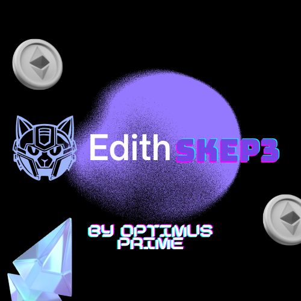

<div align="center">



# 🛡️ EDITH SKEP3

### *The Privacy-First, AI-Powered Web3 Transaction Firewall*

> **Simulate before you sign. Know before you lose.**

---

[](https://www.typescriptlang.org/)
[](https://getfoundry.sh/)
[](https://ollama.com/)
[](https://viem.sh/)
[]()
[]()

</div>

---

## 🧠 The Problem

Every year, billions of dollars are drained from crypto wallets through:

- **Infinite token approvals** — you sign once, a drainer contract steals your assets forever
- **Phishing contracts** — contracts that look like legitimate dApps but secretly transfer your funds
- **Proxy exploits** — contracts that `DELEGATECALL` into unknown implementations to execute hidden malicious logic
- **Fake airdrops** — contracts that first approve a drainer, then drain — two transactions that look innocent in isolation

**The core failure:** wallets show you a raw hex string and ask "sign?" You have no idea what the contract actually does until it's too late.

---

## ✅ The Solution

**EDITH Sentinel** intercepts the transaction *before you sign it*, runs it in a sandboxed local Ethereum fork, and uses a local AI to analyze exactly what happened — what tokens moved, what approvals were granted, what hidden sub-calls were made — and gives you a plain-English verdict.

```
                    ┌────────── YOUR MACHINE ONLY ───────────────┐
                    │                                             │
  Suspicious   ──►  │  Fork Mainnet   →   Simulate   →   AI      │  ──►  VERDICT
  Transaction       │  (Anvil/Rust)       (EVM)          (Ollama)│       SAFE / RISKY
                    │                                             │       / CRITICAL
                    └─────────────────────────────────────────────┘
                    
              Zero data leaves your machine. No cloud. No API keys.
```

---

## 🏗️ Architecture Overview

```
┌──────────────────────────────────────────────────────────────────────┐
│                         EDITH SENTINEL                                                                                         
│                                                                                                                                            
│   CLI Entry (index.ts)                                                                                                           
│   └── Commander.js + Ora spinners + Chalk terminal UI                                                     
│         │                                                                                                                                 
│         ├──► AnvilSimulator (simulator.ts)                                                                            
│         │     ├── Spawns Anvil process (Foundry/Rust EVM)                                                 
│         │     ├── Forks Ethereum Mainnet via free public RPC                                               
│         │     ├── anvil_impersonateAccount → no private key needed                                   
│         │     ├── anvil_setBalance → gives gas money                                                                
│         │     ├── eth_sendTransaction → runs tx in sandbox          
│         │     └── debug_traceTransaction → full EVM execution log   
│         │                                                            
│         ├──► TransactionParser (parser.ts)                          
│         │     ├── Fetches receipt + logs via Viem                   
│         │     ├── Decodes ERC-20 Transfer / Approval events         
│         │     ├── Detects infinite approvals (MaxUint256)           
│         │     ├── Detects unexpected token outflows                  
│         │     ├── Extracts DELEGATECALL / SELFDESTRUCT from trace   
│         │     └── Formats full report for AI consumption            
│         │                                                            
│         └──► SecurityAuditor (ai.ts)                                
│               ├── Connects to local Ollama (port 11434)             
│               ├── Sends structured security audit prompt            
│               ├── Receives VERDICT: SAFE / RISKY / CRITICAL         
│               └── Parses structured response into display           
│                                                                      
└──────────────────────────────────────────────────────────────────────┘
```

---

## 🔬 Under The Hood — How Forking Really Works

### The Common Misconception

> ❌ "You download the entire Ethereum blockchain (1.2 TB) locally"

**That is wrong.** Here's what actually happens:

### Lazy State Loading — Copy-On-Write

Anvil starts **completely empty**. It knows nothing about mainnet state. The moment your simulated transaction touches any piece of state — a wallet balance, a contract's storage slot, a piece of bytecode — Anvil fires a single RPC call to the remote node and fetches *just that one piece*, caches it in RAM, and uses it locally.

```
Transaction touches USDC contract:

  Anvil RAM (empty)                Remote RPC (ethereum.publicnode.com)
  ─────────────────                ────────────────────────────────────
  "What's the code                 eth_getCode(0xA0b869...USDC, block=24497066)
   at 0xA0b869...?"  ──────────►  returns: 0x608060405234801561001057...
                     ◄──────────
  Cache bytecode in RAM
  Run EVM against it
                                   (3-5 total RPC calls for a simple token tx)
                                   (megabytes fetched, not terabytes)
```

### The Fork Point

```
Ethereum Mainnet Timeline:
                                                     
  Block 24,497,065 ──────────────► Block 24,497,066 ──► Block 24,497,067 ──► ...
         │                                (real)               (real)
         │
         └──► Anvil "snapshot" taken here
                    │
                    └──► Your Simulated Block  (exists ONLY in your RAM)
                              │
                              └──► Anvil process killed → RAM freed → gone forever
```

Your simulated transaction runs in a **parallel universe that branches off mainnet**. Real mainnet never knows about it.

### Storage Lifetime

| Entity | Storage | Persists? |
|--------|---------|-----------|
| Ethereum Mainnet | 1.2 TB disk on real nodes | Forever |
| Anvil Fork | ~50-200 MB RAM | One session only |
| Downloaded state | RAM only | Gone on process kill |
| Your disk | Completely untouched | Nothing written |

---

## ⚙️ How Contract Code is Simulated

### Step 1 — Bytecode Acquisition

```
edith scan 0xScamContract

  → Anvil: eth_getCode(0xScamContract)
  ← "0x608060405234801561001057600080fd5b50..."
  
  This IS the contract. Raw compiled EVM bytecode.
  No source code needed. No ABI needed.
  Anvil has the full logic.
```

### Step 2 — EVM Execution (Instruction by Instruction)

```
Your tx:  from=0xYourWallet  to=0xScamContract  data=0xa9059cbb...

EVM begins:
  PC=0   PUSH1 0x60        stack: [0x60]
  PC=2   PUSH1 0x40        stack: [0x40, 0x60]
  PC=4   MSTORE            writes 0x60 to mem[0x40]
  ...
  PC=87  SLOAD  slot=0x3   ← reads YOUR token balance from storage
  PC=88  SUB               ← subtracts transfer amount
  PC=89  SSTORE slot=0x3   ← writes new balance back
  ...
  PC=134 LOG3              ← emits Transfer event  ◄─ Parser catches this
  ...
  PC=201 DELEGATECALL      ← calls implementation  ◄─ RED FLAG
  ...
  STOP                     Transaction complete
```

Every opcode. Recorded. Nothing hidden.

### Step 3 — Architectural Analysis (v2.2.0)

Raw traces tell you *what* happened, but Bytecode tells you *why*. EDITH now provides a three-layered code analysis:

1. **Sourcify (Keyless)**: Fetches verified source files directly from the decentralized Sourcify repository.
2. **Etherscan (Verified)**: Fetches original Solidity source code if the contract is verified.
3. **Decompilation (Unverified)**: If no source is found, EDITH uses public decompilation APIs (api.dedub.io) to turn raw bytecode back into readable logic for the AI.

This allows the AI to detect hidden backdoors, rug-pull logic, and malicious modifiers *within* the contract itself, even before it's ever executed.

### Step 4 — The Execution Recording

`debug_traceTransaction` on the **local Anvil node** returns the complete call tree:

```json
{
  "type": "CALL",
  "from": "0xYourWallet",
  "to": "0xScamContract",
  "calls": [
    {
      "type": "DELEGATECALL",
      "from": "0xScamContract",
      "to": "0xHiddenImplementation",
      "calls": [
        {
          "type": "CALL",
          "to": "0xAttackerWallet",
          "value": "0xDE0B6B3A7640000"
        }
      ]
    }
  ],
  "logs": [
    {
      "topics": ["0x8c5be1e5..."],
      "data": "0xffffffffffffffffffffffffffffffff"
    }
  ]
}
```

This is **ground truth** — not what the contract claims to do, but what it *actually did*.

---

## 🛡️ The Three-Layer Detection System

### Layer 1 — Deterministic Rules (parser.ts)

Hardcoded patterns that are **objectively dangerous** regardless of context:

```
┌─────────────────────────────────────────────────────────────┐
│  RULE: Infinite Approval                                     
│                                                             
│  IF Approval.amount == MaxUint256 (2^256 - 1)              
│  THEN → "INFINITE APPROVAL to {spender}"                   
│                                                             
│  Why: Spender can drain ALL your tokens, forever,          
│  without any further action from you                        
└─────────────────────────────────────────────────────────────┘

┌─────────────────────────────────────────────────────────────┐
│  RULE: Unexpected Token Outflow                             
│                                                             
│  IF Transfer.from == yourWallet                             
│  AND you did not explicitly intend to send                  
│  THEN → "Token transfer FROM your wallet"                  
└─────────────────────────────────────────────────────────────┘
```

### Layer 2 — Opcode Pattern Matching (parser.ts)

Dangerous EVM opcodes detected by walking the full call tree:

```
┌─────────────────────────────────────────────────────────────┐
│  DELEGATECALL                                               
│  ───────────                                                
│  Normal CALL: ContractB runs in its OWN storage context    
│  DELEGATECALL: ContractB runs in CALLER'S storage context  
│                                                             
│  = ContractB can READ/WRITE your token balances            
│  = Used legitimately by proxies (USDC, most DeFi)         
│  = Also the #1 tool for drainers and exploits              
│  → Always flagged, AI determines legitimacy                
└─────────────────────────────────────────────────────────────┘

┌─────────────────────────────────────────────────────────────┐
│  SELFDESTRUCT                                               
│  ────────────                                               
│  Destroys the contract and sends all its ETH elsewhere     
│  Legitimate in almost zero user-facing scenarios           
│  → Always flagged as critical                               
└─────────────────────────────────────────────────────────────┘

┌─────────────────────────────────────────────────────────────┐
│  CREATE2                                                     
│  ───────                                                    
│  Deploys a new contract at a deterministic address         
│  Used in frontrunning attacks and flash loan exploits      
│  → Flagged for AI review                                    
└─────────────────────────────────────────────────────────────┘
```

### Layer 3 — AI Semantic Reasoning (ai.ts)

The parser gives **facts**. The AI provides **judgment**.

```
Parser output (facts):
  ✓ DELEGATECALL to 0x43506849...
  ✓ No Transfer event emitted
  ✓ Transaction reverted
  ✓ Gas used: 28,622

AI reasoning (judgment):
  "A legitimate token transfer ALWAYS emits a Transfer event.
   This contract made a DELEGATECALL but emitted NO events.
   The silence + delegation to an unverified address means
   execution logic is hidden in an unknown implementation.
   The revert with no logs suggests the malicious path was
   taken but failed — indicating it IS a drainer contract
   that couldn't complete because conditions weren't met."

  → VERDICT: CRITICAL
```

**What the AI catches that rules cannot:**

| Attack Pattern | Layer 1 Rules | Layer 2 Opcodes | Layer 3 AI |
|---|:---:|:---:|:---:|
| Infinite approval | ✅ | — | ✅ explains |
| Unexpected token drain | ✅ | — | ✅ explains |
| DELEGATECALL to unknown | — | ✅ | ✅ contextualizes |
| SELFDESTRUCT | — | ✅ | ✅ contextualizes |
| No events emitted (silent drain) | ❌ | ❌ | ✅ catches |
| Reentrancy pattern | ❌ | ❌ | ✅ notices loops |
| Fake airdrop → approval → drain | ❌ | ❌ | ✅ connects chain |
| Legitimate proxy (USDC, AAVE) | ❌ can't tell | ❌ flags anyway | ✅ distinguishes |

---

## 🤖 The AI Pipeline

```
┌──────────────┐
│ Simulation             Raw JSON: receipt, logs, call trace, gas, status
│ Report                 
└──────┬───────┘
       │
       ▼
┌──────────────┐
│ parser.ts             │  Structured markdown report:
│ .formatForAI        │  - Events decoded (Transfer, Approval with amounts)
│                             │  - Trace summary (sub-call count, suspicious opcodes)
│                            │  - Pre-detected warnings (Layer 1 + 2 results)
└──────┬───────┘
       │
       ▼
┌──────────────────────────────────────────────────────────┐
│  Ollama (local, port 11434)                              
│                                                          
│  Model: qwen3:4b-instruct (runs entirely on your CPU)   
│                                                          
│  System Prompt:                                          
│  "You are EDITH, an expert Web3 security auditor.       
│   Analyze this simulated transaction trace.             
│   Look for: infinite approvals, DELEGATECALL exploits,  
│   phishing signatures, reentrancy, hidden drains.       
│   Respond with: VERDICT / REASON / TECHNICAL_DETAIL"    
│                                                          
│  Temperature: 0.1  ← deterministic, not creative        
│  Max tokens: 512   ← concise, actionable output         
└──────┬───────────────────────────────────────────────────┘
       │
       ▼
┌──────────────┐
│ parseVerdict │  Extracts structured fields from LLM response
│              │  VERDICT: SAFE | RISKY | CRITICAL
│              │  REASON: plain English for end users
│              │  TECHNICAL_DETAIL: for advanced users
└──────┬───────┘
       │
       ▼
┌──────────────┐
│ Terminal UI  │  Color-coded verdict with warnings
│ (Chalk)      │  🟢 SAFE / 🟡 RISKY / 🔴 CRITICAL
└──────────────┘
```

---

## 🔄 Full Execution Flow

```
$ edith scan 0xSuspiciousContract --method "claimAirdrop()"

  1. ┌─ Anvil spawns ─────────────────────────────────────────┐
     │  ~/.foundry/bin/anvil --fork-url ethereum.publicnode.com
     │  HTTP poll every 300ms until port 8545 responds        
     └────────────────────────────────────────────────────────┘

  2. ┌─ State available ──────────────────────────────────────┐
     │  On-demand fetch of only the storage slots your tx    
     │  touches — a few KB total, not terabytes              
     └────────────────────────────────────────────────────────┘

  3. ┌─ Wallet impersonation ─────────────────────────────────┐
     │  anvil_impersonateAccount(yourAddress)                 
     │  anvil_setBalance(yourAddress, 1 ETH)  ← gas money    
     │  No private key required. No MetaMask. Sandboxed.     
     └────────────────────────────────────────────────────────┘

  4. ┌─ Transaction simulation ───────────────────────────────┐
     │  eth_sendTransaction({ from, to, data, value })       
     │  evm_mine() → force-include in next block             
     │  Poll for receipt confirmation                        
     └────────────────────────────────────────────────────────┘

  5. ┌─ Trace extraction ─────────────────────────────────────┐
     │  debug_traceTransaction(txHash, {tracer:'callTracer'}) 
     │  Called on LOCAL Anvil — completely free              
     │  Returns full recursive call tree with all opcodes    
     └────────────────────────────────────────────────────────┘

  6. ┌─ Parsing ──────────────────────────────────────────────┐
     │  Decode events → Transfer, Approval, etc.             
     │  Detect infinite approvals → Layer 1                  
     │  Extract DELEGATECALL/SELFDESTRUCT → Layer 2          
     │  Format full report for AI                            
     └────────────────────────────────────────────────────────┘

  7. ┌─ AI Analysis ──────────────────────────────────────────┐
     │  Local Ollama → qwen3:4b-instruct                     
     │  Receives simulation report                           
     │  Returns VERDICT + REASON → Layer 3                   
     └────────────────────────────────────────────────────────┘

  8. ┌─ Verdict ──────────────────────────────────────────────┐
     │  SAFE     → 🟢 Transaction appears legitimate         
     │  RISKY    → 🟡 Proceed with caution + explanation     
     │  CRITICAL → 🔴 DO NOT SIGN + threat detail            
     └────────────────────────────────────────────────────────┘

  9. Anvil.kill() → RAM freed → nothing persisted → clean exit
```

---

## 📦 Tech Stack

| Layer | Technology | Purpose |
|---|---|---|
| **CLI** | Commander.js + Inquirer | Argument parsing, interactive prompts |
| **Terminal UI** | Chalk + Ora | Colors, spinners, rich output |
| **Blockchain Fork** | Foundry Anvil (Rust) | Local EVM, mainnet state forking |
| **Blockchain Client** | Viem v2 | Type-safe Ethereum interactions |
| **Local AI** | Ollama | Privacy-preserving LLM inference |
| **Language** | TypeScript 5 | Type safety across entire codebase |
| **Free RPC** | ethereum.publicnode.com | No API key, no rate limits for forking |

---

## 🚀 Setup & Usage

### Prerequisites

**1. Install Foundry (Anvil)**
```bash
curl -L https://foundry.paradigm.xyz | bash
foundryup
```

**2. Install & Start Ollama**
```bash
# Install from https://ollama.com
ollama serve
ollama pull qwen3:4b-instruct
```

### Installation

```bash
git clone <repo>
cd edith-sentinel
npm install
npm run build
npm link      # This installs the 'edith' command globally!
```

### Commands

```bash
# Scan a contract interaction (most common use case)
edith scan 0xContractAddress --method "claimAirdrop()"

# Scan and replay a historical transaction hash
edith scan 0xTxHash...

# Simulate with a specific wallet address
edith scan 0xContract --from 0xYourWallet --method "approve(address,uint256)"

# Use an explicit RPC alias (like llamarpc) with graceful fallback
edith scan 0xContract --rpc llamarpc

# Setup or change your AI Brain (Cloud vs Local)
edith brain

# Run scan using your configured Cloud AI (Gemini, OpenAI, etc.)
edith scan 0xContract --brain

# View exhaustive EVM Call Traces and State Diffs
edith scan 0xContract -v

# Test AI connection without running a full simulation
edith test-ai
```

### Example Output

```
  ╔══════════════════════════════════════════════════════╗
  ║   🛡️  EDITH SKEP3  ·  Transaction Firewall        ║
  ║   Privacy-First · Local AI · No Data Leaves Machine  ║
  ╠══════════════════════════════════════════════════════╣
  ║   Target : 0xScamContract...                         ║
  ║   Fork   : Ethereum Mainnet (via PublicNode)         ║
  ║   Engine : Anvil + Ollama (100% Local)               ║
  ╚══════════════════════════════════════════════════════╝

  ✔ Mainnet forked at block #24,497,066
  ✔ Impersonating wallet: 0xf39Fd...
  ✔ Simulation complete → tx: 0xd977...
  ✔ Trace extracted — 1 event, 2 sub-calls

  [SIMULATION RESULT]
    Status   : REVERTED
    Gas Used : 28622
    Events   : 1
    [Events]
      • Approval(address,address,uint256) @ 0xUSDC
        owner:   0xYourWallet
        spender: 0xDrainerContract
        amount:  INFINITE (Max Uint256)

  ──────────────────────────────────────────────────────
  [PARSER WARNINGS]
  ⚠️  INFINITE APPROVAL granted to 0xDrainerContract for USDC
  🔴  Suspicious opcode: DELEGATECALL to 0xUnknownImpl

  [🤖 AI SECURITY AUDIT — EDITH ANALYSIS]
  This transaction grants unlimited spending rights to an
  unknown contract. Combined with a DELEGATECALL to an
  unverified implementation, this is a textbook drainer
  pattern. Do not sign under any circumstances.

  🚨 VERDICT: CRITICAL
  ──────────────────────────────────────────────────────

    ██ DO NOT SIGN THIS TRANSACTION ██
    High probability of asset theft or drainer contract.
```

---

## 🔒 Privacy Architecture

```
What EDITH Sentinel NEVER does:
  ✗ Send your wallet address to any external service for analysis
  ✗ Upload your transaction data to any cloud API
  ✗ Require a paid RPC with account registration
  ✗ Use an external AI API (no OpenAI, no Anthropic, no cloud)
  ✗ Write anything to disk during simulation
  ✗ Phone home with usage data

What it DOES:
  ✓ Fetch only the specific contract bytecode + storage it needs
  ✓ Run all AI inference locally via Ollama
  ✓ Destroy all simulation state when done
  ✓ Use anonymous public RPC endpoints with no auth
```

---

## 📜 Changelog

### v2.4.0 — The "Robustness" Update
EDITH Sentinel is now faster, far more accurate, and resilient against RPC failures and EVM false positives. 

- **EVM Gas & State Diff Precision**: Fixed a false positive where standard gas fees paid for reverted transactions were being flagged as malicious asset drains. `parser.ts` now natively identifies and subtracts execution gas cost from raw State Differences.
- **Dynamic LlamaRPC Integration**: Added `--rpc llamarpc` alias. Includes Cloudflare WAF bypass strategies and a seamless, interactive command-prompt failover back to `ethereum.publicnode.com` if rate-limited!
- **Verbose Forensic Logging**: Added the `-v` (or `--verbose`) flag. View the exact JSON execution path (Call Traces) and precise mutated wallet balances (State Diffs) right in your terminal.
- **AI "Verification Poison" Fix**: Contracts officially verified on Etherscan or Sourcify no longer blindly inherit heuristic Threat Alerts inside the AI context prompt, drastically lowering false positive rates on standard proxies like USDC. 
- **Dynamic 4byte Signatures**: Replaced hardcoded topic dictionaries with active REST lookups to the 4byte Directory, translating unknown DeFi calldata signatures into plain-English event names for the AI on the fly.
- **Massive Context Expansion**: Trace slicing limits were boosted from 64 to 512 bytes, and Contract Code analysis limits were 5x'd to 25,000 bytes, ensuring massive modern dApps are fully digested by cloud brains.

---

## 🗺️ Roadmap

- [ ] **ABI auto-detection** — fetch verified ABIs from Etherscan for richer log decoding
- [ ] **Multi-chain support** — Polygon, Arbitrum, Base, BSC
- [ ] **Historical tx replay** — proper block pinning for replaying confirmed transactions
- [ ] **Batch scan** — scan all pending txs in a MetaMask queue
- [ ] **Browser extension** — intercept signing requests directly in the wallet UI  
- [ ] **NFT transfer detection** — ERC-721 and ERC-1155 event decoding
- [ ] **Reentrancy depth analysis** — detect recursive call patterns automatically
- [ ] **Known drainer database** — flag addresses reported in community threat feeds

---

<div align="center">

---

```
  ╔════════════════════════════════════════════════════════╗
  ║                                                        ║
  ║   Engineered by  anu-sin-theta  AKA  Optimus Prime    ║
  ║                                                        ║
  ║              https://anufied.me                        ║
  ║                                                        ║
  ║   Assisted by Trillion Artificial Parameters           ║
  ║                                                        ║
  ╚════════════════════════════════════════════════════════╝
```

*"Simulate before you sign. The blockchain never forgets — but with EDITH, you never have to regret."*

</div>
